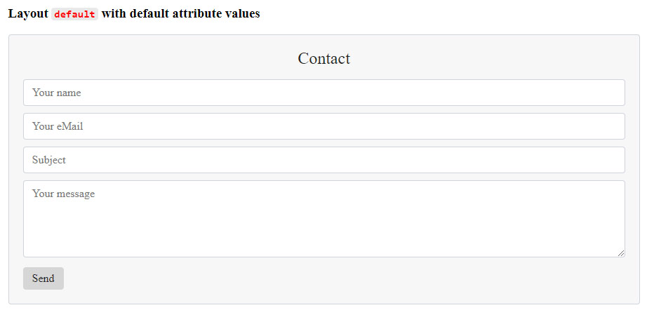

# Contact Form

With this repo you can easily and quickly integrate an email contact form into your site.

The contact form can be customized.

**See the comments in the files for more information.**

The repo includes all necessary files and shows examples how to include the contact form.

### Multiple contact forms

It is possible to display several contact forms on one page. They are completely independent of each other.

## Preview

The contact form with the default values and the `default` layout. **No other CSS inside the page**.



The contact form with the default values and the `icons` layout. **No other CSS inside the page**.


The contact form with custom settings and the `default` layout. The fonts are taken from the CSS file of the page.


The contact form with custom settings and the `icons` layout. The fonts are taken from the CSS file of the page.


## Quick view

For your project you need the `ContactForm_1.3.2.js` file and `the contact-form.php` file.

Here is an example of how to integrate the contact form into your HTML / PHP page.

```html
<!DOCTYPE html>
<html lang="de">
  <head>
    <meta charset="UTF-8" />
    <meta name="viewport" content="width=device-width, initial-scale=1.0" />
    <title>Contact Form</title>

    <!-- 1. Implement the "ContactForm_1.3.2.js" file -->
    <!-- Note: use "defer" -->
    <script src="./assets/js/ContactForm_1.3.2.js" defer></script>
  </head>

  <body>
    <main>
      <!-- 2a. Layout "default" => default values -->
      <contact-form></contact-form>

      <!-- 2b. Layout "icons" => default values -->
      <contact-form layout-name="icons"></contact-form>

      <!-- 2c. Layout "default" => changing some attributes -->
      <contact-form
        bg-color="#1b669b"
        text-color="#eaeaea"
        text-align="left"
        btn-color="#289310"
        btn-text-color="#eaeaea"
        btn-align="center"
      ></contact-form>
    </main>
  </body>
</html>
```

## Description

#### 1. Step - download and add

Download or clone the repo and add the two files `contact-form.php` and `ContactForm_1.3.2.js` into your project.

#### 2. Step - implementation

Include the `ContactForm_1.3.2.js` file in the corresponding HTML or PHP file with `<script src="./path-to-the-file/ContactForm_1.3.2.js" defer></script>` in the `<head>`-Tag.

#### 3. Step - your mail address

Go to the `contact-form.php` file and **enter your mail address in the variable `$receiver`** (see the comment in the file).

#### 4. Step - the path

Go to the `ContactForm.js` file and **specify the relative path to the `contact-form.php` file in the `#mailPath` variable** (see the comment in the file).

Alternatively you can use the `mail-path` attribute in the `<contact-form></contact-form>` HTML tag. See the example _"Default with the path to the "contact-form.php" file"_ in the `index.html` file.

#### 5. Step - insert the HTML tag

Insert the `<contact-form></contact-form>` tag in the desired HTML or PHP file at the desired position.

The contact form will now be displayed with the default values.

#### 6. Step - customize the contact form

To customize the contact form according to your wishes change the corresponding attributes in the `<contact-form></contact-form>` HTML tag.

Only the attributes that are to be changed need to be specified.

For example, change the background color:

```html
<contact-form bg-color="#ededed"></contact-form>
```

See for more the examples in the `index.html` file.

**The list of all attributes:**

- `layout-name` => set the layout. There is a choice of `default` (does not have to be set) and `icons`.
- `container-padding` => padding for the contact form. Default: `20px`. Set `container-padding="0"` for no padding.
- `bg-color` => background color of the contact form
- `bg-border` => border of the background
- `bg-border-radius` => border radius of the background
- `text-color` => color of the title and subtitle text
- `text-align` => set text the `contact-title` and `contact-subtitle` to `center`, `left` or `right`
- `contact-title` => text of the title. If it is an empty string nothing will be displayed
- `contact-subtitle` => text of the subtitle. If it is an empty string nothing will be displayed
- `name-placeholder` => Text in the name input field
- `mail-placeholder` => Text in the mail input field
- `subject-placeholder` => Text in the subject input field
- `message-placeholder` => Text in the message input field
- `btn-color` => background color of the submit button
- `btn-text` => text of the submit button
- `btn-text-color` => color of the submit button text
- `btn-align` => set the button `center`, `left` or `right`
- `success-message` => text if the message was sent successfully
- `error-message` => text if the message was NOT sent successfully
- `mail-signature` => Signature at the end of the mail. **The host name is automatically used.**
- `invalid-mail` => Warning text if the mail address is not correct
- `mail-path` => relative path to the `contact-form.php` file (see 4. Step)
- `icon-color` => color for the icons, **if you use the `layout-name`-Attribute `icons`**
- `bg-color-icons` => bockground color for the icons, **if you use the `layout-name`-Attribute `icons`**
- `text-name` => Text for the input field of the name
- `text-email` => Text for the input field of the email address
- `text-subject` => Text for the input field of the subject
- `text-message` => Text for the input field of the message
- `subject-field` => If the attribute is set with the value `select`, the subject field becomes a select field. The function `setOptions(options)` is required to set the `options`. See the last three examples, the `my-javascript.js` file and "The subject field as a `select` HTML element".

**Example for all attributes (default values):**

```html
<contact-form
  layout-name="default"
  container-padding="20px"
  bg-color="#f7f7f7"
  bg-border="1px solid #ced4da"
  bg-border-radius="0.25rem"
  text-color="#262626"
  text-align="center"
  contact-title="Contact"
  contact-subtitle=""
  name-placeholder="Your name"
  mail-placeholder="Your Email address"
  subject-placeholder="Subject"
  message-placeholder="Your message"
  btn-color="#d6d6d6"
  btn-text="Send"
  btn-text-color="#262626"
  btn-align="left"
  success-message="Thank you! Your message has been sent."
  error-message="Something went wrong. The mail could not be sent."
  mail-signature="A Message from [host name]"
  invalid-mail="Invalid mail address"
  icon-color="inherit"
  bg-color-icons="#e9ecef"
  text-name=""
  text-email=""
  text-subject=""
  text-message=""
>
</contact-form>
```

You can set the default values in the `ContactForm_1.3.2.js` as you wish, so you don't have to set them in the `<contact form></contact form>` tag (again and again).

### The subject field as a `select` HTML element

The subject field can be used not only as `input:text`, but also as a `select` HTML tag in order to select certain predefined topics.

Proceed as follows:

1. Set the attribute `subject-field` with the value `select` in the `<contact form></contact form>` -tag.
2. Select the `<contact form></contact form>` and pass it the list of options using the `setOptions()` method.

Example:

```js
const demoSubjectSelect = document.querySelector('contact-form');

// NOTE: whitespaces must be replaced with "%20"
const options = [
  { value: 'Option%20One', text: 'Option One' },
  { value: 'Option%20Two', text: 'Option Two' },
  { value: 'Option%20Three', text: 'Option Three' },
];

demoSubjectSelect.setOptions(options);

// If the value of the `select`-tag is required outside, it can be read as follows:
console.log(demoSubjectSelect.selectSubject.value);
// Or set:
demoSubjectSelect.selectSubject.value = 'Hardware%20problem';
```

See the last three examples and the `my-javascript.js` file.

#### 7. Step - more CSS

If you want to have more influence on the design, you can do this in your CSS file with the pseudo-element `::part()` ([documentation](https://developer.mozilla.org/en-US/docs/Web/CSS/::part)).

You can design:

- title => h2-tag
- subtitle => p-tag
- input => input-tag
- textarea => textarea-tag
- button => button-tag

Here are some simple examples:

```css
contact-form::part(h2-tag) {
  font-size: 22px;
}

contact-form::part(p-tag) {
  font-size: 16px;
}

contact-form::part(input-tag)::placeholder {
  color: red;
}

contact-form::part(textarea-tag) {
  color: green;
}

contact-form::part(button-tag) {
  font-size: 12px;
}
```

### Note:

Sending a mail when the project is on your computer and not on a server in the network will not work because it is blocked by the CORS policy.
