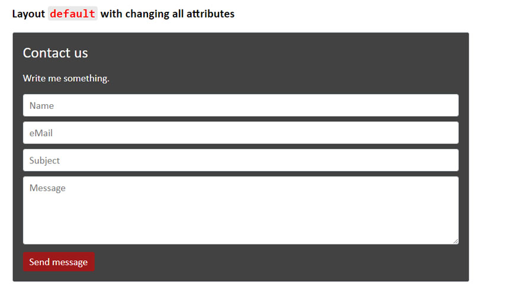

# Contact Form

With this repo you can easily and quickly integrate an email contact form into your site.

The contact form can be customized.

**See the comments in the files for more information.**

The repo includes all necessary files and shows examples how to include the contact form.

## Preview

The contact form with the default values. No other CSS inside the page.


The contact form with custom settings. The fonts are taken from the CSS file of the page. Here with Bootstrap CSS.



## Description

#### 1. Step - download and add

Download or clone the repo and add the two files `contact-form.php` and `ContactForm.js` into your project.

#### 2. Step - implementation

Include the `ContactForm.js` file in the corresponding HTML or PHP file with `<script src="./path-to-the-file/ContactForm.js"></script>`.

#### 3. Step - your mail address

Go to the `contact-form.php` file and **enter your mail address in the variable `$receiver`** (see the comment in the file).

#### 4. Step - the path

Go to the `ContactForm.js` file and **specify the relative path to the `contact-form.php` file in the `#mailPath` variable** (see the comment in the file).

Alternatively you can use the `mail-path` attribute in the `<contact-form></contact-form>` HTML tag. See the example _"Default with the path to the "contact-form.php" file"_ in the `index.html` file.

#### 5. Step - insert the HTML tag

Insert the `<contact-form></contact-form>` tag in the desired HTML or PHP file at the desired position.

The contact form will now be displayed with the default values.

#### 6. Step - customize the contact form

To customize the contact form according to your wishes change the corresponding attributes in the `<contact-form></contact-form>` HTML tag.

Only the attributes that are to be changed need to be specified.

For example, change the background color:

```html
<contact-form bg-color="#ededed"></contact-form>
```

See for more the examples in the `index.html` file.

The list of all attributes:

- `bg-color` => background color of the contact form
- `text-color` => color of the title and subtitle text
- `contact-title` => text of the title. If it is an empty string nothing will be displayed
- `contact-subtitle` => text of the subtitle. If it is an empty string nothing will be displayed
- `name-placeholder` => Text in the name input field
- `mail-placeholder` => Text in the mail input field
- `subject-placeholder` => Text in the subject input field
- `message-placeholder` => Text in the message input field
- `btn-color` => background color of the submit button
- `btn-text` => text of the submit button
- `btn-text-color` => color of the submit button text
- `success-message` => text if the message was sent successfully
- `error-message` => text if the message was NOT sent successfully
- `mail-signature` => Signature at the end of the mail
- `invalid-mail` => Warning text if the mail address is not correct
- `mail-path` => relative path to the `contact-form.php` file (see 4. Step)

Example for all attributes:

```html
<contact-form
  bg-color="#424242"
  text-color="#ffffff"
  contact-title="Contact"
  contact-subtitle=""
  name-placeholder="Name"
  mail-placeholder="eMail"
  subject-placeholder="Subject"
  message-placeholder="Message"
  btn-color="#9e1a1a"
  btn-text="Send"
  btn-text-color="#ffffff"
  success-message="Your message has been sent."
  error-message="Something went wrong. The mail could not be sent."
  mail-signature="A Message from my-domain.com"
  invalid-mail="Invalid mail address"
>
</contact-form>
```

#### 7. Step - more CSS

If you want to have more influence on the design, you can do this in your CSS file with the pseudo-element `::part()` ([documentation](https://developer.mozilla.org/en-US/docs/Web/CSS/::part)).

You can design:

- title => h2-tag
- subtitle => p-tag
- input => input-tag
- textarea => textarea-tag
- button => button-tag

Here are some simple examples:

```css
contact-form::part(h2-tag) {
  font-size: 22px;
}

contact-form::part(p-tag) {
  font-size: 16px;
}

contact-form::part(input-tag)::placeholder {
  color: red;
}

contact-form::part(textarea-tag) {
  color: green;
}

contact-form::part(button-tag) {
  font-size: 12px;
}
```

### Note:

Sending a mail when the project is on your computer and not on a server in the network will not work because it is blocked by the CORS policy.
